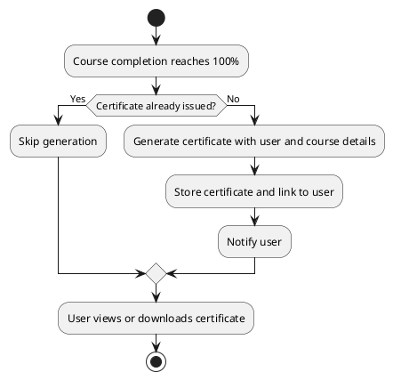

# UC: Certificate Issuance

## Description

When a user completes all lessons of a course, the system generates a certificate of completion. The certificate includes the user's details, the course details, and an issue date, and can be viewed and downloaded by the user.

## Actor(s)

* Primary Actor: User
* Supporting Actor: System (certificate generator)

## Preconditions

* The user must be logged in.
* The user must have completed 100% of a course's lessons.

## Postconditions

* A certificate is generated and made available to the user.

## Triggers

* The user reaches 100% completion of a course.

## Normal Flow

1. The system detects that the user has completed all lessons of a course.
2. The system generates a certificate containing the user and course details and an issue date.
3. The certificate is stored and linked to the user's account.
4. The user is notified that a certificate is available.
5. The user views or downloads the certificate from the Certificates page.

## Alternative Flows

2.1 If a certificate already exists for the user and course, the system does not generate a duplicate.
5.1 If certificate generation fails, the system logs the error and retries; the user is shown a pending state.

## UML Activity Diagram

