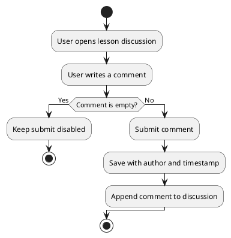

# UC: Comments

## Description

Users can add comments to lessons to ask questions, share insights, and discuss the material with other learners. Each comment is associated with a user and a lesson and is shown in the lesson's discussion section.

## Actor(s)

* Primary Actor: User

## Preconditions

* The user must be logged in.
* The user must be viewing a lesson.

## Postconditions

* The comment is saved and displayed in the lesson's discussion.

## Triggers

* The user submits a comment on a lesson.

## Normal Flow

1. The user opens a lesson and navigates to the discussion section.
2. The user writes a comment in the input field.
3. The user submits the comment.
4. The system validates and saves the comment with the author and a timestamp.
5. The comment appears in the lesson's discussion list.

## Alternative Flows

3.1 If the comment is empty, the submit action is disabled and nothing is saved.
4.1 If saving fails, an error message is displayed and the draft is preserved.

## UML Activity Diagram

