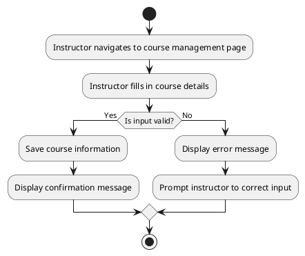

# UC: Course Management

## Description

Instructors can create, update, and manage courses. This includes adding descriptions, managing course visibility, and assigning instructors.

## Actor(s)

* Primary Actor: Instructor

## Preconditions

* The instructor must be logged in.

## Postconditions

* The course is created or updated successfully.

## Triggers

* The instructor initiates course creation or update.

## Normal Flow

1. The instructor navigates to the course management page.
2. The instructor fills in the course details.
3. The system validates the input.
4. The system saves the course information.
5. A confirmation message is displayed.

## Alternative Flows

3.1 If the input is invalid, an error message is displayed, and the instructor is prompted to correct the input.

## UML Activity Diagram

