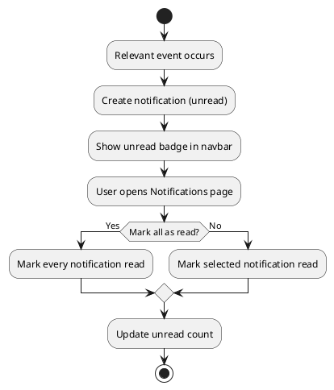

# UC: Notifications

## Description

The system sends notifications to users about important events such as new lessons, course invitations, leaderboard changes, and earned certificates. Users can view their notifications and mark them as read.

## Actor(s)

* Primary Actor: User
* Supporting Actor: System (notification dispatcher)

## Preconditions

* The user must have an account.

## Postconditions

* The notification is delivered to the user and its read/unread status is tracked.

## Triggers

* A relevant event occurs (e.g. new lesson added, invitation received, certificate issued).

## Normal Flow

1. An event relevant to the user occurs.
2. The system creates a notification with a message and an unread status.
3. The notification appears with an unread badge in the navigation bar.
4. The user opens the Notifications page and reads the notification.
5. The system marks the notification as read (individually or via "mark all read").

## Alternative Flows

4.1 The user marks all notifications as read at once; the system updates every notification's status.
2.1 If the user has disabled a notification category, the system suppresses notifications of that type.

## UML Activity Diagram

