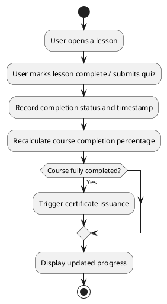

# UC: Progress Tracking

## Description

Users can track their progress through lessons and quizzes. The system records completion status and timestamps, computes course completion percentages, and presents progress back to the user.

## Actor(s)

* Primary Actor: User

## Preconditions

* The user must be logged in.
* The user must be enrolled in at least one course.

## Postconditions

* The user's progress is recorded and reflected in their dashboard and profile.

## Triggers

* The user completes a lesson or submits a quiz.

## Normal Flow

1. The user opens a lesson within an enrolled course.
2. The user marks the lesson as complete (or submits a quiz).
3. The system records the completion status and timestamp.
4. The system recalculates the course completion percentage.
5. The updated progress is displayed on the dashboard and profile.

## Alternative Flows

2.1 The user un-marks a previously completed lesson; the system updates progress accordingly.
3.1 If the progress update fails to save, an error message is displayed and the previous state is retained.

## UML Activity Diagram

