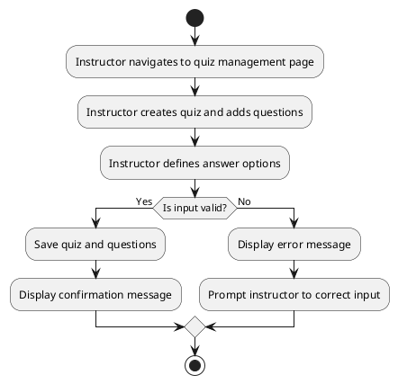

# UC: Quiz Management

## Description

Instructors can create quizzes for lessons and manage their questions and answers. This includes adding questions of different types (multiple choice, true/false, short answer, estimation), defining correct answers, and updating the quiz over time.

## Actor(s)

* Primary Actor: Instructor

## Preconditions

* The instructor must be logged in.
* A lesson must exist to attach the quiz to.

## Postconditions

* The quiz and its questions are created or updated successfully.

## Triggers

* The instructor initiates quiz creation or question management.

## Normal Flow

1. The instructor navigates to the quiz management page for a lesson.
2. The instructor creates a quiz and adds one or more questions.
3. For each question, the instructor defines the question text, type, and answer options.
4. The system validates the input.
5. The system saves the quiz and its questions.
6. A confirmation message is displayed.

## Alternative Flows

3.1 If a question has no correct answer defined, the system warns the instructor and prevents saving until corrected.
4.1 If the input is invalid, an error message is displayed, and the instructor is prompted to correct the input.

## UML Activity Diagram

