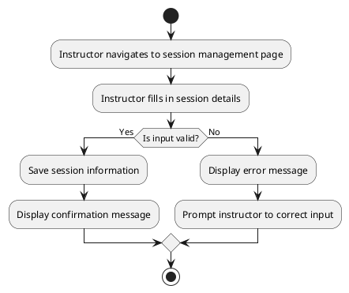

# UC: Session Management

## Description

Instructors can add and manage sessions within courses. This includes setting availability dates and updating session details.

## Actor(s)

* Primary Actor: Instructor

## Preconditions

* The instructor must be logged in.
* A course must exist.

## Postconditions

* The session is created or updated successfully.

## Triggers

* The instructor initiates session creation or update.

## Normal Flow

1. The instructor navigates to the session management page.
2. The instructor fills in the session details.
3. The system validates the input.
4. The system saves the session information.
5. A confirmation message is displayed.

## Alternative Flows

3.1 If the input is invalid, an error message is displayed, and the instructor is prompted to correct the input.

## UML Activity Diagram

